# 📈 SmartAPI MA Crossover Alert Bot


A professional trading bot that monitors real-time market data from **Angel One SmartAPI**, detects Moving Average (MA) crossovers on 5-minute candles, and sends instant alerts to Telegram. It strictly filters for **Confirmed Crossovers** (candle close) to ensure high-quality signals (No Repainting).

---

## ✨ Features

- **🚀 Bullish Crossover Alerts**: Triggers when MA9 crosses **ABOVE** MA20.
- **🔴 Bearish Crossover Alerts**: Triggers when MA9 crosses **BELOW** MA20.
- **✅ Verified Signals**: Logic waits for the candle to CLOSE before alerting. No "forming" candle alerts.
- **🔄 Multi-Alert System**: Sends alerts for *every* new crossover throughout the day.
- **🛡️ Secure**: Environment-based configuration to keep your credentials safe.
- **☁️ Cloud Ready**: Optimized for deployment on PythonAnywhere.

---

## 🧠 Logic & Strategy

The bot runs every 5 minutes and performs the following checks:

### Unified Crossover Logic

The bot analyzes the **Confirmed (Closed) Candle** to detect trend reversals based on the movement of the Short-Term MA (9) relative to the Long-Term MA (20).

```mermaid
graph TD
    Start[Start: Every 5 Mins] -->|Fetch Data| Check{Is Last Candle Closed?}
    Check -- No (Forming) --> Wait[Ignore & Wait]
    Check -- Yes --> Prev{Check Previous State}
    
    %% Bullish Path
    Prev -- "Prev MA9 ≤ MA20" --> BullCheck{Current MA9 > MA20?}
    BullCheck -- Yes --> BullAlert[🚀 SEND BULLISH ALERT]
    BullCheck -- No --> NoAct[No Action]

    %% Bearish Path
    Prev -- "Prev MA9 ≥ MA20" --> BearCheck{Current MA9 < MA20?}
    BearCheck -- Yes --> BearAlert[🔴 SEND BEARISH ALERT]
    BearCheck -- No --> NoAct
```



- **Bullish 🚀**: Detects when the MA9, having been below, crosses **ABOVE** the MA20.
- **Bearish 🔴**: Detects when the MA9, having been above, crosses **BELOW** the MA20.

### 3. Confirmed Candle Logic
To prevent false signals from "repainting" (where a crossover happens during the candle but disappears before close), the bot **ignores the current forming candle** and analyzes the last completed candle.

---

## 🚀 Installation & Setup

### Prerequisites
- Python 3.8+
- Angel One SmartAPI Credentials
- Telegram Bot Token & Chat ID

### 1. Clone the Repository
```bash
git clone https://github.com/yourusername/smartapi_ma_crossover_alert.git
cd smartapi_ma_crossover_alert
```

### 2. Install Dependencies
```bash
pip install -r requirements.txt
```

### 3. Secure Configuration
Create a `.env` file in the root directory. **NEVER share this file.**

```ini
SMARTAPI_API_KEY=your_api_key
SMARTAPI_CLIENT_ID=your_client_id
SMARTAPI_PASSWORD=your_password
SMARTAPI_TOTP_SECRET=your_totp_secret
TELEGRAM_BOT_TOKEN=your_bot_token
TELEGRAM_CHAT_ID=your_chat_id
# Optional: Set to 'True' to run once and exit (for cron jobs)
# RUN_ONCE=False 
```

### 4. Run the Bot
```bash
python main.py
```

---

## ☁️ Deployment

### PythonAnywhere
This project is configured for seamless deployment on PythonAnywhere.

1.  **Upload Code**: Use the Files tab to upload all `.py` files and `requirements.txt`.
2.  **Environment**: Create a virtualenv and install requirements.
3.  **Secrets**: Create the `.env` file on the server.
4.  **Task**: Set up an "Always-on Task" for continuous monitoring.

See [PA_DEPLOY.md](PA_DEPLOY.md) for a detailed step-by-step guide.

---

## 🔒 Security Best Practices

> [!IMPORTANT]
> **Your API Keys are your money.** Follow these rules:

1.  **Never commit `.env` to GitHub.** Use `.gitignore`.
2.  **Rotate Keys**: If you suspect a leak, regenerate your API keys immediately.
3.  **Use Environment Variables**: The code uses `python-dotenv` to load secrets securely from the environment.

---

## 🛠️ Project Structure

```
smartapi_ma_crossover_alert/
├── main.py              # Core logic and scheduler
├── indicators.py        # MA calculation & crossover detection
├── smartapi_client.py   # Angel One API wrapper
├── telegram_alerts.py   # Telegram notification system
├── config.py            # Configuration loader
├── utils.py             # Logging and time helpers
├── .env                 # Secrets (NOT TRACKED)
├── .gitignore           # Security rules
└── requirements.txt     # Dependencies
```

---

## 📜 License

MIT License. Use at your own risk. This bot provides information, not financial advice.
